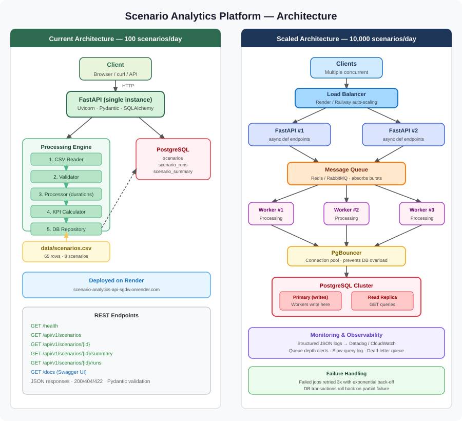

# System Design — Scenario Analytics Platform



## Current Architecture (100 scenarios/day)

```
Client (Browser / curl)
        |
        v
  FastAPI (single instance)
        |
        +------ POST /ingest -----> Processing Engine (in-process)
        |                                   |
        |                                   v
        |                            PostgreSQL (single node)
        |
        +------ GET /api/v1/scenarios -----> PostgreSQL
```

At 100 scenarios/day the entire pipeline runs synchronously inside the API process. A single FastAPI instance and a single PostgreSQL node are sufficient.

---

## Scaled Architecture (10,000 scenarios/day)

```
                    Clients
                       |
                       v
              Load Balancer (e.g. Render / Railway auto-scaling)
                  /         \
                 v           v
          FastAPI #1     FastAPI #2   (horizontal replicas)
                  \         /
                   v       v
              Message Queue (e.g. Redis / RabbitMQ)
                       |
              +---------+---------+
              v         v         v
          Worker #1  Worker #2  Worker #3   (processing engine replicas)
              |         |         |
              v         v         v
         PostgreSQL (primary + read replica)
              |
              v
         Connection Pool (PgBouncer)
```

---

## Scaling Components and Rationale

### API Layer
- **Horizontal scaling**: Run multiple FastAPI replicas behind a load balancer.
- **Async endpoints**: Use `async def` handlers so I/O does not block the event loop.
- **Stateless design**: No session state in the API process — safe to scale out.

### Processing Layer
- **Decouple ingestion from processing**: The API accepts a CSV upload and enqueues a job. Workers consume jobs independently.
- **Why a queue?** At 10,000 scenarios/day (~7/minute), synchronous processing would block API responses and risk timeouts. A queue absorbs bursts.
- **Worker scaling**: Add more worker replicas when queue depth grows.

### Database
- **Connection pooling (PgBouncer)**: Many API + worker replicas would exhaust PostgreSQL's connection limit without pooling.
- **Read replica**: Reporting/GET queries go to the replica; writes go to the primary.
- **Indexes**: Already defined on `scenario_id`, `status`, and `start_time` to keep aggregation queries fast as row count grows.
- **Partitioning** (future): Partition `scenario_runs` by month if the table exceeds tens of millions of rows.

### Monitoring & Logging
- Structured JSON logs from all services → centralized log aggregator (e.g. Datadog, CloudWatch).
- Queue depth metric triggers auto-scaling of workers.
- Database slow-query log alerts on queries exceeding 500 ms.

### Failure Handling
- Failed queue jobs are retried up to 3 times with exponential back-off.
- Dead-letter queue captures permanently failed jobs for manual inspection.
- API returns `202 Accepted` for async ingestion so clients are not blocked.
- Database transactions ensure partial writes are rolled back.

---

## Summary Table

| Concern | 100/day solution | 10,000/day solution |
|---|---|---|
| API | Single FastAPI instance | Multiple replicas + load balancer |
| Processing | Synchronous, in-process | Async workers consuming a queue |
| Database writes | Direct from API | Workers write after dequeuing |
| Database reads | Single node | Primary + read replica |
| Connections | Direct psycopg2 | PgBouncer connection pool |
| Observability | App logs | Centralized logging + metrics |
| Failure recovery | Exception → 500 response | Retry queue + dead-letter queue |
